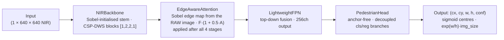

# NIRDet — NIR Pedestrian Detector

A from-scratch, single-class, anchor-free pedestrian detector built specifically for
**850nm active-NIR surveillance imagery** — trained end-to-end from random init on
miniNIRPed, with no pretrained weights.

| | |
|---|---|
| Architecture | NIRBackbone → EdgeAwareAttention → LightweightFPN → PedestrianHead |
| Model size | **4.85M params** (4,851,754 trainable) |
| Input | Single-channel NIR, 640×640, pixels in [0, 1] |
| Task | Anchor-free person detection (1 class) |
| Loss | Focal (γ=2, α=0.25) ÷ n_pos + CIoU (λ_cls=1.0, λ_reg=2.0) |
| Training | 261 NIR images · 100 epochs · AdamW · bf16 · RTX 4050 |
| Inference | **18.5 ms/image** on RTX 4050 @ 640×640 (≈54 FPS) |

---

## Architecture



### Components

| Module | Params | Design |
|---|---|---|
| **NIRBackbone** | 486,944 | Single-channel stem seeded with 6 Sobel/Laplacian kernels; depthwise-separable CSP blocks (gradient highway via split-bypass); 4 stages [1,2,2,1] → P3/P4/P5 at 128/256/256ch |
| **EdgeAwareAttention** | 41 | Learns the attention map from the *raw image* (valid edge prior from epoch 0, no dependency on unformed features); 4 Sobel-initialised edge filters, frozen for the first 5 epochs, then trainable; residual form F·(1+0.5A) preserves flat body-mass context while amplifying silhouettes |
| **LightweightFPN** | 1,934,848 | Standard top-down FPN: 1×1 laterals, nearest-neighbour upsample + add, 3×3 smoothing (Lin et al., CVPR 2017) |
| **PedestrianHead** | 2,429,957 | FCOS/YOLOX-style decoupled head; direct (cx, cy, w, h) regression with a pedestrian size prior baked into the reg bias (prior_w=0.04, prior_h=0.15) |

---

## Results

| Run | Setup | Best mAP50 |
|---|---|---|
| **Overfit test** | 10 images, 300 epochs, flat LR | **1.0000** |
| **Full training** | 261 train / 160 val, 100 epochs | **0.5846** |
| YOLO11n baseline (COCO-pretrained) | same split, fine-tuned | 0.735 |

### Evaluation — Phase 9 (checkpoints/best.pth, epoch 75, val split = 160 images, RTX 4050 Laptop)

**Accuracy** (trainable params: 4,851,754)

| Metric | Value |
|---|---|
| mAP50 | **0.5846** (baseline YOLO11n: 0.7350, Δ −0.1504) |
| mAP@75 | 0.2127 |
| mAR@300 | 0.4084 |
| mAP small / medium / large | 0.0571 / 0.3377 / 0.3804 |
| Best-F1 operating point | conf 0.318 → P 0.657 / R 0.590 / F1 0.622 |

**Latency** (evaluate.py, FP32)

| Device | Resolution | Latency | Throughput |
|---|---|---|---|
| GPU — RTX 4050 Laptop | 640×640 | 29.26 ± 6.77 ms | 34.2 FPS |
| CPU | 640×640 | 249.8 ± 16.4 ms | 4.00 FPS |
| CPU | 320×320 | 102.8 ± 16.0 ms | 9.73 FPS |
| Raspberry Pi 5 (estimate) | 640×640 | ~0.80–1.33 FPS | 3–5× CPU slowdown; PyTorch FP32 — not yet NCNN-converted |

**Hard cases & deployment**

- 4 pure false-negative images saved to `eval_outputs/hard_cases/`
- **Deployment status:** not yet deployable on Pi 5 at real-time speed in current PyTorch form. Next step: ONNX export → NCNN conversion → INT8 quantization → on-device benchmark.

- Training loss: 2.14 → ~0.54 (lowest 0.535 @ epoch 94; no NaN, no divergence)
- Validation mAP50 climbs steadily: 0.042 (ep5) → 0.221 (ep10) → 0.490 (ep30) → **0.585 (ep75)**, then plateaus; early stopping fires at ep95 after 4 evals without gain
- The 0.735 baseline is a COCO-**pretrained** YOLO11n; NIRDet trains **from scratch** on 261 images. The −0.15 gap is the pretraining gap, not a pipeline defect — the overfit test (mAP 1.0) proves the model fits and the loss/decode/metric path is fully consistent.

---

## Dataset — miniNIRPed

850nm narrowband NIR pedestrian dataset, same modality as our NoIR + 850nm LED array.

| Split | Images | Annotated |
|---|---|---|
| train | 261 | 254 |
| val | 160 | 157 |
| test | 165 | **0 (labels are empty)** |

The `test/` split ships with images only — no annotations — so **val is the evaluation set**. Test images are kept for qualitative / export checks.

---

## Training

```bash
python train.py                # full training: 100 epochs, val every 5
python train.py --overfit-test # 300 epochs on 10 images, flat LR (expect mAP50 > 0.9)
python train.py --smoke-test   # 5 epochs, 10 images: no NaN, no OOM
python train.py --resume checkpoints/last.pth
```

Training hygiene: bf16 AMP, gradient clipping (10.0), cosine LR with 5-epoch warmup,
deterministic validation (no augmentation), early stopping with a warmup floor
(patience never counts while mAP is still ~0).

Evaluation detail: mAP50 is measured at a lowered NMS score threshold (0.05) so the
metric integrates the full precision–recall curve; the deployment threshold (0.25)
is restored afterwards.

---

## Testing

```bash
python test_attention.py   # 6/6  — shapes, range, gradients, edge sensitivity, freeze logic
python test_backbone.py    # pass — shapes, param budget, gradients, Sobel init
python test_head.py        # pass — shapes, priors, decode consistency (train == infer)
python test_neck.py        # 3/3  — shapes, gradient flow, information flow
python losses.py           # 4/4  — empty GT, assignment, NaN guard, loss direction
python test_model.py       # Tests 1–3: forward (train/infer), param count
                           # Test 4 (overfit) is opt-in: --overfit --images 4x --labels 4x
                           # (uses a simplified proxy loss; the real end-to-end
                           #  overfit check is `python train.py --overfit-test`)
```

The train/inference decode-consistency tests guarantee the model optimises the same
parameterisation it is evaluated under (sigmoid centres, exp(w/h)·img_size, no cap).

---

## Repository layout

```
nirdet/
├── train.py            # training loop (CFG, LR schedule, eval, early stopping)
├── model.py            # NIRDet assembly + inference decode + NMS
├── backbone.py         # NIRBackbone (Sobel stem, CSP-DWS)
├── attention.py        # EdgeAwareAttention (raw-image edge attention)
├── neck.py             # LightweightFPN
├── head.py             # PedestrianHead (anchor-free, decoupled)
├── losses.py           # focal ÷ n_pos + CIoU, label assignment, self-tests
├── dataset.py          # NIR dataset, augmentations, collate
├── config.py           # documented config dataclasses
└── test_*.py           # unit tests per module
```

---

## Roadmap

- **Multi-class extension** (person + weapons + vehicles) — head cls branch,
  label plumbing, class-aware NMS
- **EAA upgrade** — per-image edge-magnitude normalisation + learnable temperature
  (current attention has ~2% spatial variance on dark NIR frames)
- **Edge export** — ONNX/NCNN INT8 for Raspberry Pi 5 (+ Hailo-8L op coverage)
- **3×3 centre-neighbourhood assignment** — ~9× more positives for cold-start mAP

---

*VCE ECE Department Project · Batch 2028 — Pranay, Chandana, Sreekar*
